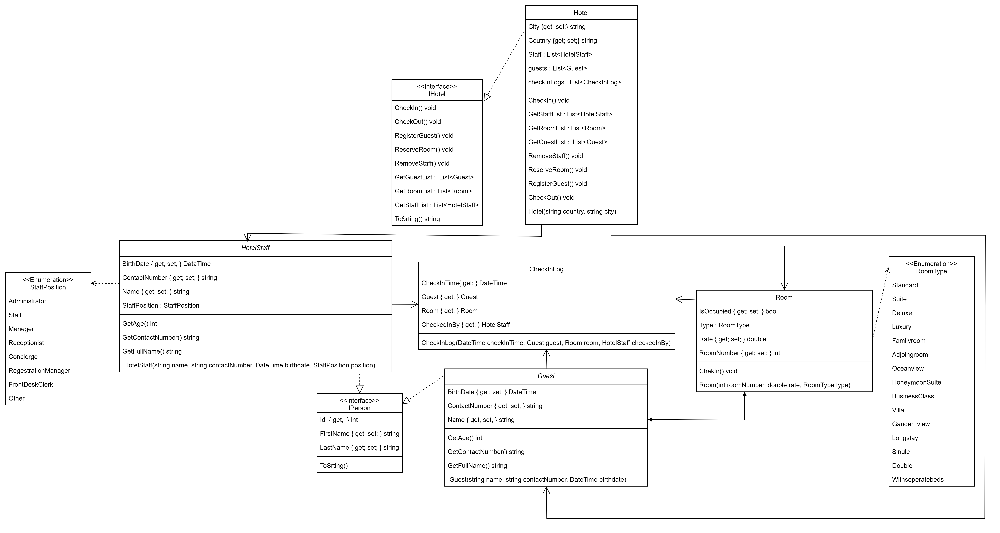

# Project_partA_Horbach_program

# Опис предметної області

Для даного проекту було обрана предметна область готельний бізнес та управління готелем.

# Основні елементи предметної області:

**Клас Hotel**

Готель (Hotel): Основна сутність, яка представляє сам готель. Містить інформацію про країну та місто, де він розташований, а також має списки гостей, номерів та персоналу.

**Клас Guest**

Гість (Guest): Представляє клієнта готелю. Містить ім'я, контактний номер, дату народження тощо.

**Клас Room**

Номер (Room): Описує конкретний номер в готелі. Має унікальний номер, тип (одномісний, двомісний, люкс тощо), стан (зайнятий або вільний) та розцінку.

**Клас HotelStaff**

Персонал (HotelStaff): Включає працівників готелю. Кожен працівник має ім'я, контактний номер, дату народження та посаду в готелі (адміністратор, обслуговуючий персонал тощо).

**Клас CheckInLog**

Журнал заселення (CheckInLog): Зберігає інформацію про заселення гостей: час заселення, інформацію про гостя, номер та персонал, який провів заселення.

# ДІАГРАМА КЛАСІВ

Детальне проєктування елементів моделі предметної області

